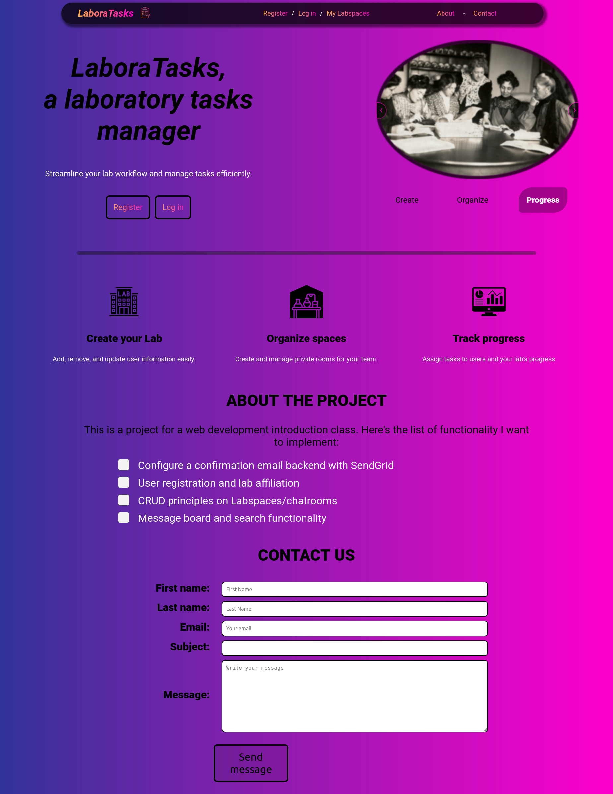

# LaboraTasks project

## About the project

This is the main project of a university class which act as an intro to web development using the Django Framework.

## Demo

### User registration and login

 

### Chatroom messaging

 

### CRUD on chatrooms

 

### Email backend

 

### Simple error handling

 

## Steps TODO for live demo
Host the app (for free) with the following steps:
1. Host the github repo on a web hosting service ([PythonAnywhere](https://PythonAnywhere.com) or [Vercel](https://vercel.com))

2. Setup static files ([AWS S3](www.https://aws.amazon.com/s3/))

3. Migrate the Sqlite3 db to PostgresSQL ([Railway](https://aws.amazon.com/s3/) or [Render](https://render.com/docs/databases))

## About the app
The goal was to introduce myself and get familiar with the Django framework. Basically the app is just a chatroom-style app : register/login to an account, create or join a lab, create/edit labspaces (chatrooms), post/edit/delete messages.

I also wanted to play around with CSS and implement a bit of JavaScript for some of the functionalities and user interactions.

## To install locally
Prep your environment (Python > 3.7)
1. `python -m venv laboratasks`
2. `source laboratasks/bin/activate`
3. `pip install -r requirements.txt`

Clone and run locally
1. `git clone git@github.com:simlal/labtasks.git`
2. `cd labtasks/labtasks`
3. `python manage.py runserver`

## Contact
Get in touch with me :)

-> [personnal email](mailto:simlalonde@hotmail.com)

-> [LinkedIn](https://www.linkedin.com/in/simon-lalonde/)
